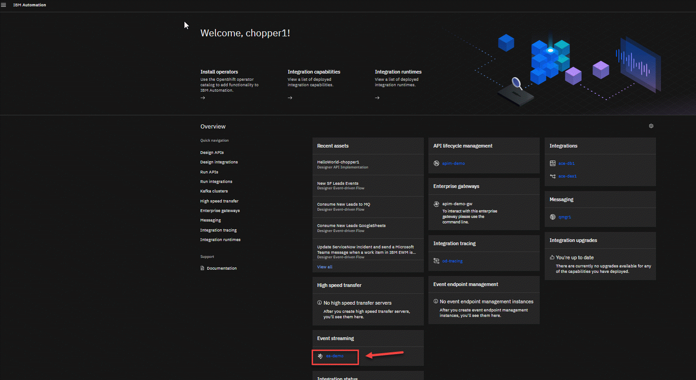
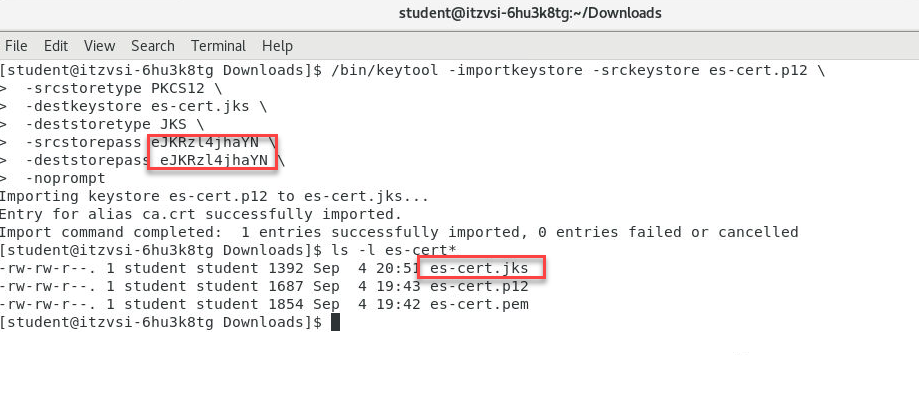
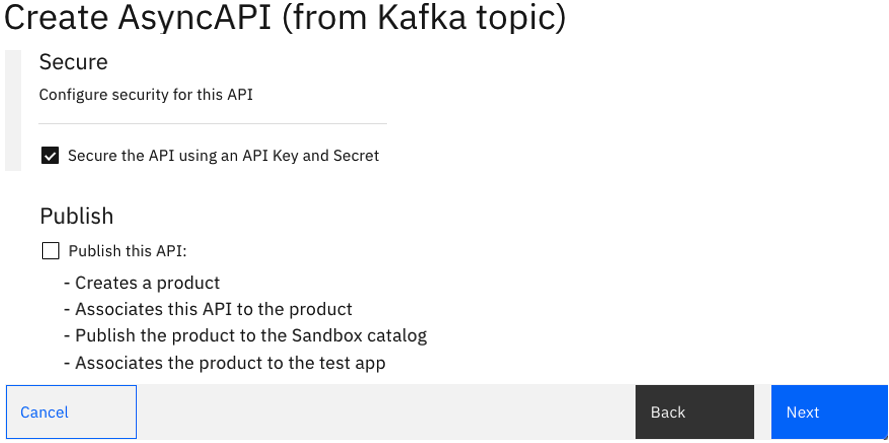
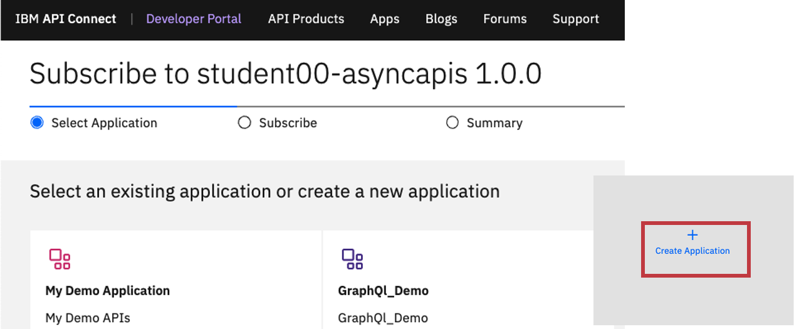

[Return to main EEM lab page](../ReadMe.md#lab-abstracts)

# IBM Cloud Pak for Integration - Creating AsyncAPI

In this lab, students will go through steps on how to create a Topic in Event Streams, and build an AsyncApi and publish it the IBM API Connect Developer Portal and IBM Event Gateway.

# 0. Clean VDI
1\. Open a terminal window:


2\. Run the following commands:
```
rm f /home/student/Downloads/es-cert.*
rm f /home/student/Downloads/bootstrap.*
```


# 1. Configure Kafka resources in IBM Event Streams

## 1.1 Create the Kafka topic<a name="Setup_kafka"></a>

From the Cloud Pak for Integration Platform Navigator, open the IBM Event Streams Console. <br>
If you need to review logging in to the Platform Navigator review the steps in the [Return to main lab page](../../Login-pn/ReadMe.md)


1\. Now go to the tab for **es-demo** or you can click on the link from the home page and this will take you to the IBM Event Streams home page.   



2\. Now we will create our topic. Click on the **Create a topic** tile.


3\. Now enter the name of your topic.  Since this is a shared Kafka broker, use your userid as part of the topic name.  In this example, we are logged in as palpatine4 so the topic name is **STUDENT04.FLIGHT.LANDINGS**.  Click **Next**.


4\. Leave the partitions at 1 and click **Next**.


5\. Since this is for a lab, change the Message retention to **A day** and click **Next**.
**Note:** If we wanted to retain message longer we could change this to meet those needs.


6\. For the Replicas, we will set the **Minimum in-sync replicas** to **1** and select **Replication factor:1**.  Note:  Make sure that the radial button next to Replication factor:1 is selected before clicking **Create topic**.


7\. Now you will be back on the Topics screen.  You may see other user's topics in the list but make sure you see your topic you just created.  
Created topic STUDENT04.FLIGHT.LANDINGS. <br>


## 1.2 Obtain connection information and credentials to the Kafka cluster (Optional)

**Note**: This task is optional. A set of connection parameters and certificates is already available and provided by instructor in the student resources folder. You can skip this task and jump to [Next Task](#Manager), or you can perform these steps and obtain connection parameters and certificates from scratch, or just read the steps to understand this process and use the provided parameters.

1\. Now we will select the **Connect to this Cluster** tile.

 ![alt text][pic3]

2\. Now we will see the Cluster connection screen. Make sure you select **External** and then click the **Generate SCRAM credentials**.

![alt text][pic4]

3\. For the **credentials name** use \<clustername>\<userid>, such as **chopper1**, but make sure you use the userid assigned to you.  Make sure the **Produce messages, consume messages and create topics and schemas** button is selected and then click **Next**.

![alt text][pic5]

4\. On the next screen select **All topics**. Click **Next**.

![alt text][pic6]

5\. Do the Same on this page for the consumer groups (**All consumer groups**).  Click **Next**.

![alt text][pic7]

6\. Select the **All transactional IDs**.  Click **Generate credentials**.

![alt text][pic8]

7\. Now that we have the credentials generated open a text file (e.g run *gedit* on terminal window or use Notepad)  and use the icon to copy them and save them for use later in other labs.

* a\. Save the bootstrap URL of the cluster
* b\. Save the SCRAM Username
* c\. Save the SCRAM password

8\. Last is to download the PEM certificate.

![alt text][pic9]

9\. Save the **es-cert.pem** in the *Downloads* folder. This will be used later to connect to the Event Stream Cluster.

![alt text][pic10]

10\. We will also save the PKCS12 password and download the certificate, this will be used to connect to the Event Stream Cluster when using the toolkit flows.

![alt text][pic11]

The Scram Credentials, and the es-cert.pem certificate will be used during AsyncApi configuration in IBM Api Connect. <br>

We will also need to create JKS file based on es-cert.p12. This JKS file will be used later in another lab when implementing a Kafka producer application. <br>

11\. Using the terminal window, go to the **Downloads** directory where you have the es-certs and run the following command.  

**Note** for the srcstorepass and the deststorepass use the PKCS12 password you saved when you download the cert.

```
cd ~/Downloads
/bin/keytool -importkeystore -srckeystore es-cert.p12 \
        -srcstoretype PKCS12 \
        -destkeystore es-cert.jks \
        -deststoretype JKS \
	-srcstorepass xxxxxxx  \
	-deststorepass xxxxxx \
	-noprompt
```

After running this command you will now have the es-cert.jks



The Scram Credentials, and the es-cert.jks certificate will be used later in IBM App Connect Toolkit Flow to simulate flight landing events. <br>


# 2. Api Connect - Manager <a name="Manager"></a>

### Important
At this point you should have the following information (Either you created it by your own in previous section, or either you obtained it from the instructor thru the *Resources* shared folder): <br>
a) bootstrap address of your Event Streams Cluster <br>
b) SCRAM credentials (username and password) <br>
c) The file with PEM certificate, es-cert.pem <br>
d) The file with PKCS12 certificate, es-cert.p12 <br>
e) The file with JKS keystore es-cert.jks<br>
f) The password for both the PKCS12 and JKS keystores <br>

You should have copied this info  to a text file on the VDI and the cert files should be in your Downloads directory.  

![alt text][pic12]

## 2.1 Create AsyncAPI

From the IBM Cloud Pak for Integration Platform Navigator, open the Api Management Console. <br>

1\. From the Home page select "Develop APIs and products" tile.<br>


2\. Click on Add and select AsyncAPI <br>


<br>

3\. Introduce the following values, **replacing XX** with your student id (e.g 01, 02, ...,19 ), and click **Next**:<br>

```
Title: studentXX-asyncapi-flight-landings
Summary: Events emitted when a flight lands
Bootstrap Servers: Copy/Paste the bootstrap address the Event Streams cluster
Topic Name: STUDENTXX.FLIGHT.LANDINGS (change the XX to the number of your topic
Security Protocol: SASL_SSL
SASL mechanism: SCRAM-SHA-512
SASL Username: <SCRAM-username>
SASL Password: <SCRAM-password>
Transport CA Certificate: Drag/Drop the es-cert.pem from the Downloads folder
```


4\. Confirm that *-Secure the API using API Key and Secret-* option is selected and click **Next**


<br><br>
5\. The AsyncAPI specification has been succesfully generated. Review the summary page and click **Edit API**


<br><br>


## 2.2 Edit the API

Edit the API to add the Flight Landing Event Schema.<br>

1\. Click on the Source Icon as below


2\. Select "message: {}" line as below <br>

 <br>

3\. Replace the line with "message: {}" with the below schema.<br>

```
      message:
        name: landingEvent
        title: Flight landing event
        summary: Flight landing information
        description: >-
          This API provides a stream of events based on the landing of planes at
          Bodapati Airport
        schemaFormat: application/vnd.aai.asyncapi;version=2.0.0
        contentType: application/json
        payload:
          type: object
          required:
            - flight
            - terminal
            - passengers
          properties:
            flight:
              description: ID for the flight that has landed
              type: string
            terminal:
              description: Which terminal the flight has landed at
              type: string
            passengers:
              description: Number of passengers on the flight
              type: string
            additionalProperties: false
        examples:
          - payload: |
              { "flight" : "AI100",  "terminal" : "2", "passengers": "100"}
```
4\. Make sure that there are no validation errors and save the API.<br><br>


## 2.3 Create configure the API Product contaning the API

1\. Return to the *Develop* section, click **Add** and select **Product**


2\. Chosse **New product** click **Next**.


3\. Introduce the following values and click **Next** Make sure to change the number in your new product to match you userid and topic.  

    Title: studentXX-asyncapis
    Summary: APIs for Events emitted when a flight lands


4\. In the **APIS** panel, select the entry for the API you created in previous section, and click **Next**


5\. In the **Plans** panel we will use the default values. Click **Next**


6\. We will use default values again for **Publish**, **Visibility** and **Subscribability** options. Click **Next**


7\. When done you will see the Summary page.   Click **Done** to finish the task. You will be redirected to the **Develop** section.


<br>

## 2.4 Publish the Product
1\.Now, the **Develop** section, switch to **Products** tab, and then, click on the **3 dots** icon for the API product we just created and select the **Stage** action to promote the AsyncApi's product to the IBM Api Connect Developer Portal and to the IBM Event Gateway.


2\. Choose the radio button for **Sandbox**. Then choose **Publish to specific gateway services**. Make sure **event-gateway** is selected and click **Next**


3\. Click **Stage**. We will use default values again for **Visibility** and **Subscribability** options.
At this point the definition of the API Product and AsyncApi will be promoted to the Sandbox catalog.


4\. Now navigate to API Manager Home (Home Icon on top left) --> Manage Catalogs, select the Sandbox catalog.


5\. You will see the **Products** tab showing the different products and the state on each of them. Click on the **3 dots** icon for the API product we have staged and select the **Publish** action.


6\. Finally, we will publish the product. This will push the Product and API configurations to both **API Gateway** and **Developer Portal** components of API Connect. Click **Publish**.


<br><br>

# 3. API Connect Developer Portal

The IBM API Connect Developer Portal provides consumers access to API Catalog information. This gives application developers the opportunity to explore and test APIs, register applications, and subscribe to Plans.

## 3.1 Access the Developer Portal

1\. Locate the developer portal Url, by navigating to *Manage*  (Icon on the left) and select Sandbox catalog.


2\. Click on "Catalog Settings" tab.


3\. Click on Portal tab on left panel, and copy the Portal URL and paste it in a new browser tab.


4\. Signon to API Connect Developer Portal. An account has already been created for you (consumer01), credentials will be provided by the instructor. Go to **Sign in** in the upper right corner and enter the Username and Password. Click **Sign in** button.


The home page is presented, showing the recent API Products


## 3.2 Subscribe to AsyncAPI

1\.Select *studentXX-asyncapis* Product. This shows details of the Product, including the APIs and the Plans that are offered by this Product. Click de **Select** button for the *Default* plan


2\. We will create a new set of credentials. Click **Create Application**



3\. Provide a value for the *Title* field (e.g studentXX-asyncapi-demo-app) and click **Save**:


A new panel with the generated credentials is shown.
**Important**:
Copy and Save the Key (ClientId), and the Secret into Notepad before closing this panel. These will be used by the Async Client java application.


4\. Select the new application that you just created.


5\. In the *Confirm Subscription* panel, review the subscription info and click *Next*


6\.Finally we have the new credentials for a customer app and a  subscription created. Click **Done** to complete the task.


<br><br>

# 4. Obtain Event Gateway Bootstrap certificate (optional)
**Note**: This task is optional. A Gateway Bootstrap certificate is already available and provided by instructor in the student resources folder. You can skip this task, or you can perform these steps and obtain Gateway Bootstrap certificate by your own, or just read the steps to understand the process and use the provided parameters.


We will now need to obtain Event Gateway bootstrap certificate, to be used by the Kafka Consumer programs. <br/>

1\. First we will need to get the ocp login for our account.  Sign in to the OCP cluster provided by instructor and use the credentials you were assigned.</br>
From the OCP console in the upper right click the the drop down and select Copy Login.


2\. You will see a new tab. Click **Display Token**.<br/>


You will see a *oc command* like the following.

**Example**

```
oc login --token=sha256~xxxx --server=https://xxxx-coc-cluster:32167
```


3\. Copy the *oc command* line, and paste it in a terminal window to logon to OpenShift CLI. <br/>
If prompted, type 'y' to allow use unsecure connections<br>


4\. Now run the following commands to obtain the Event Gateway bootstrap url and server certificate.<br>

```
cd ~/Downloads

EVENT_GW_ROUTE_NAME=`oc get route -n cp4i-apic | grep event-gw-client | awk '{print$1}'`
BOOTSTRAP_HOST=`oc get route $EVENT_GW_ROUTE_NAME -n cp4i-apic  -o jsonpath="{.spec.host}"`

echo $BOOTSTRAP_HOST

echo -n | openssl s_client -connect $BOOTSTRAP_HOST:443 -servername $BOOTSTRAP_HOST -showcerts | openssl x509 > bootstrap.crt
```

**Copy the value of the BOOTSTRAP_HOST variable to Notepad**.

5\. Run also the following commands to generate a P12 and JKS file with the server certificate<br>

```

/bin/keytool -import -noprompt \
        -alias bootstrapca \
        -file bootstrap.crt \
        -keystore bootstrap.p12 -storepass passw0rd

/bin/keytool -importkeystore -srckeystore bootstrap.p12 \
        -srcstoretype PKCS12 \
        -destkeystore bootstrap.jks \
        -deststoretype JKS \
	      -srcstorepass passw0rd  \
	      -deststorepass passw0rd \
	      -noprompt
```
<br>

**Important**: <br>
The BOOTSTRAP_HOST url, and bootstrap.p12 will be used in kafka-console-consumer.sh program. <br>
The BOOTSTRAP_HOST url, and bootstrap.jks will be used in java client application. <br>
<br>


<br>
<br>
[Return to main EEM lab page](../ReadMe.md#lab-abstracts)

[pic0]: ../images/0.png
[pic1]: ../images/1.png
[pic2]: ../images/2.png
[pic3]: ../images/3.png
[pic4]: ../images/4.png
[pic5]: ../images/5.png
[pic6]: ../images/6.png
[pic7]: ../images/7.png
[pic8]: ../images/8.png
[pic9]: ../images/9.png
[pic10]: ../images/10.png
[pic11]: ../images/11.png
[pic12]: ../images/12.png
