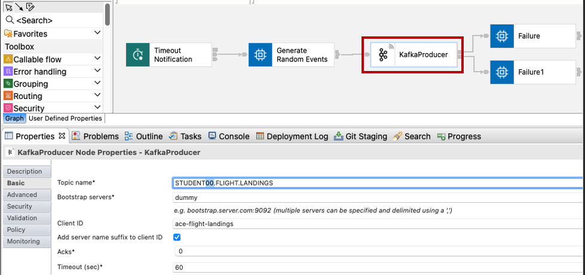
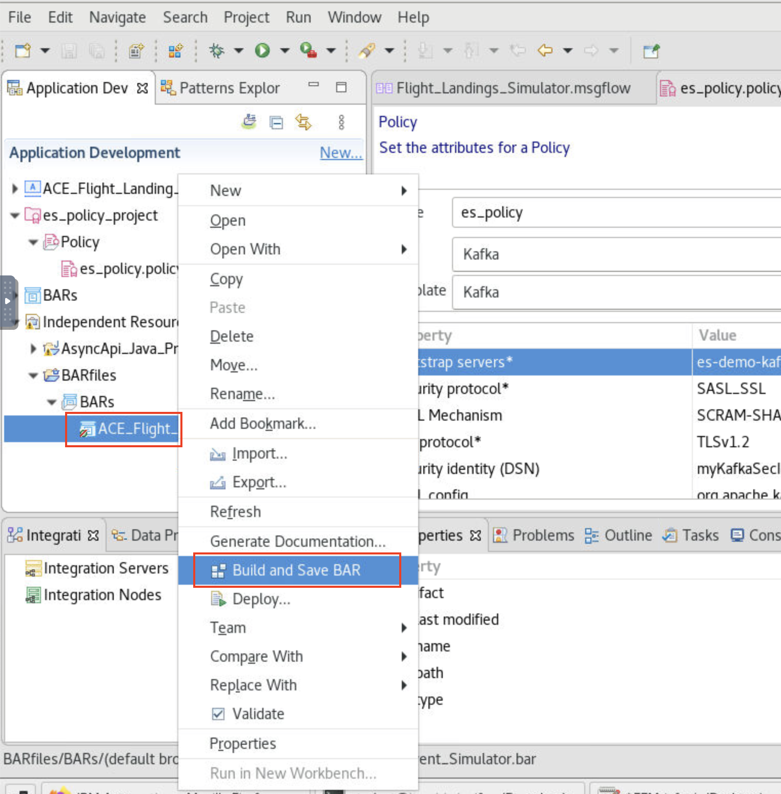
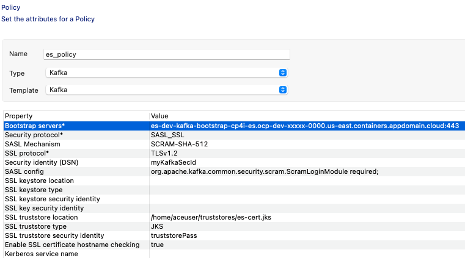
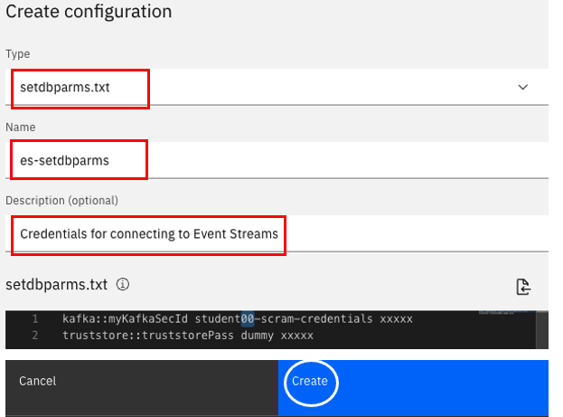

  [Return to main EEM lab page](../ReadMe.md#lab-abstracts)
  # IBM Cloud Pak for Integration - Flight Landing Events Simulator

  In this lab, students will go through steps on how to simulate flight landing events, and consume the events using Kafka Client programs. <br>
  In this case will use **IBM App Connect**, our application integration solution, to implement and integration flow connect against our Kafka broker and produce Kafka flight landing events. **IBM App Connect** is also part of the **Cloud pak for Integration** platform.


  # 1. App Connect Toolkit

  **App Connect Toolkit** is a eclipse based tool that allows creating integration applications following a *no code/low code* approach.

  ## Flight landing event generator Message Flow

  A pre-built integration flow is provided for this step. This is a simple App Connect Toolkit Flow to generate Flight Landing events.<br>

  1\. Download the **AsyncApi_Toolkit_PIF.zip** <br>
  Click here and save the zip file - [AsyncApi_Toolkit_PIF.zip](../source/project-interchange/AsyncApi_Toolkit_PIF.zip)

  

  <br>

  2\. If not done before, open **App Connect Toolkit** by running the following command in a terminal window:

  ```
  ace toolkit

  ```

  From the Workspace Launcher we will create a new workspace for the work in this lab guide. Enter the Workspace name */home/student/IBM/ACET12/flights* and click **Launch**

  


  If the *Import Projects* windown appears, click **Cancel**<br/>
  Close the *Welcome* tab in case it is shown in the central canvas.


  3\. Import Project Interchange AsyncApi_Toolkit_PIF.zip into App Connect Toolkit. Follow menu *File > Import > Project Interchange*. Select AsyncApi_Toolkit_PIF.zip from the Downloads folder and click **Finish**.
  <br><br>

  


  ### Modify TOPIC name with yours Topic name in integration flow.<br>

  4\. In the *Application Development* tab, locate the *Fligh_Landings_Simulator* flow and open it by **double-click**

  

  5\. Select the *KafkaProducer* node, and change the value of the *Topic name* property with the one that correspond to your user id. Save the flow (*File > Save*)

  

  <br>

  6\. Update/Re-build the BAR file in which it is packaged the integration application for later deployment. In the *Application Development* tab, locate the *ACE_Flight_Landing_Event_Simulator.bar* bar file and do *right-click > Build & Save BAR*

  

  Then Click **OK** on the *Override configurable properties* dialog to confirm.

  

  ### Set Kafka bootstrap url thru Kafka Policy

  7\. In the *Application Development* tab, locate the *es_policy* artifact and open it by **double-click**

  

  8\. Update bootstrap url with yours saved in  Notepad and **save** the policy (*File > Save*)

  

  <br>

  9\. Export the policy as a zip file (*Right click* on the *es_policy_project* element > Export > Archive File), and export it to file *es-policy.zip* in Downloads folder.


  
  <br><br>


  # 2. Deploy configurations and Flow thru App Connect Enterprise Dashboard

  1\. Switch to web browser and from Cloud Pak for Integration Platform Navigator, open App Connect Dashboard. Use the navigation menu in the upper left corner and go to *Run > Integrations*<br>

  

  #### Event Streams Policy Project configuration
  2\. Navigate to Configuration Icon on the left panel, and click Configuration.<br>

  

  3\. Click "Create Configuration", and set the following values

  ```
  Type: Policy project
  Name: es-policy
  ```

  4\. Set the *es-policy.zip* file that you exported from App Toolkit and click **Create**

  

  #### Truststore configuration

  5\. Repeat the process to create a configuration object for the JKS file that contains the bootstrap server certificate, using the following values, and click **Create**

  ```
  Type: Truststore
  Name: es-cert.jks
  File: es-cert-jks (from Downloads folder)
  ```

  

  #### Kafka user Credentials and jks password - setdbparms.txt configuration

  5\. Repeat the process to create a configuration objet for the Kafka user Credentials, using the following values, and click **Create**
  
  **Note:** Use the SCRAM credentials and truststore password you obtained for connecting to Event Streams in Lab1

  ```
  Type: setdbparms.txt
  Name: es-setdbparms
  Description: Credentials for connecting to Event Streams

  setdbparms.txt:
  kafka::myKafkaSecId <SCRAM-user> <SCRAM-password>
  truststore::truststorePass dummy <EventStreams-Truststore-password>

  ```

  

  <br>

  ## Deploying the Tookit integration flow - BAR (Broker Archive) file

  1\. Navigate to "Servers" view Icon on the left panel and click **Create Server**.

  

  2\. Select **Medium Integration** tile. <br>

  

  3\. Select the bar file located at */home/student/IBM/ACET12/flights/BARfiles/ACE_Flight_Landing_Event_Simulator.bar* , or drag and drop the bar file from ACE Toolkit to ACE Dashboard "Create Server" wizard as below, and click **Next**<br>

  

  4\. Search for "es-" configurations. <br>
  Make sure all es-policy, es-setdbparms, es-cert.jks configurations are selected, and click **Next**

  

  5\. Set the name *tk-flight-simulator* for the integration server, and click **Create**

  

  <br>
  Wait for few minutes for the Integration Server to be ready.<br>
  You may need to refresh browser page.

  

  <br>

  # 3. Event Streams Console - Verify Flight Events

  1\. Use the Cloud Pak navigation menu in the upper left corner and go to *Run > Kakfka Clusters* to open Event Streams Console.<br/>
  Then clilck on the *Topics* icon on the left, and open your STUDENTXX.FLIGHT.LANDINGS topic.

  

  2\. Verify if the Flight Landing Events are being generated as below. <br>

  
  <br>
  <br>
  <br>


  [Return to main EEM lab page](../ReadMe.md#lab-abstracts)
