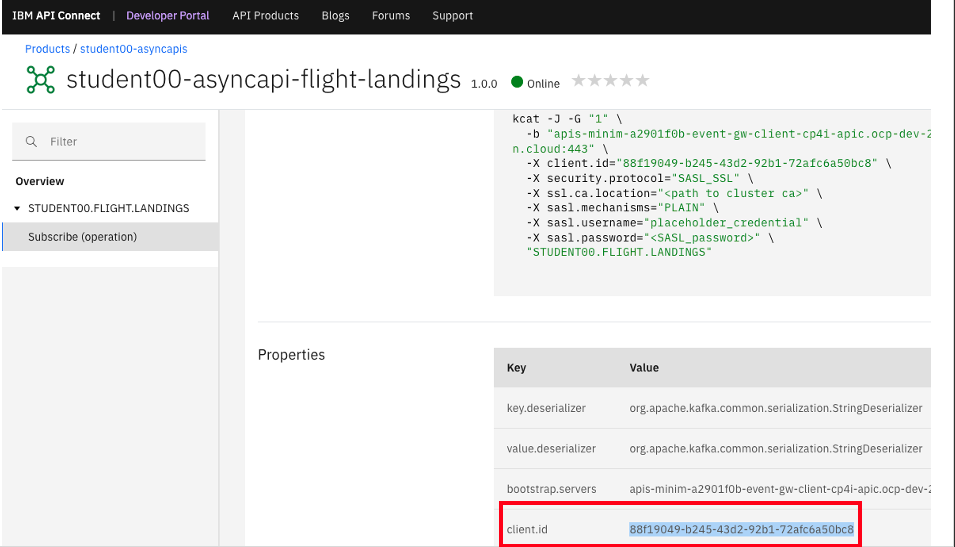
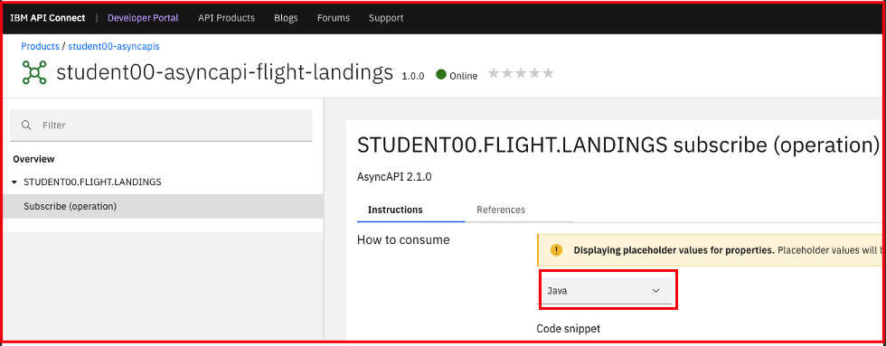

[Return to main EEM lab page](../ReadMe.md#lab-abstracts)

# IBM Cloud Pak for Integration - AsyncApi - Consuming Flight Landing Events

In this lab, you will follow steps to consume the flight landing events using Kafka Clients  kafka-console-consumer.sh, kafkacat  and Java Client.<br/>

Those clients will consume events thru the **API Connect Event Gateway**, which will enforce valid subscription and credentials that were created in **Lab1** using **API Connect Developer Portai**

# 1. Consuming Flight Landing Events

## 1.1 kafka-console-consumer.sh

Receive flight landing events using open-source kafka-console-consumer.sh <br>

1\.Switch to web browser pointing API Connect Developer Portal, navigate to your Async API and select the *Subscribe* operation.<br>


2\. Copy the code snippet by clicking "Copy to Clipboard" icon on right

3\. Paste the command on text editor (e.g. notepad, gedit) and modify the command: verify/change bootstrap-server, username, password, ssl.truststore.location, ssl.truststore.password, ssl.truststore.type fields.<br>

**bootstrap-server**: bootstrap url for the Event Gateway<br/>
**username**: client id/key of APIC developer portal/application <br>
**password**: secret of the APIC developer portal application <br>
**ssl.truststore.location**: ./bootstrap.jks <br>
**ssl.truststore.password**: passw0rd <br>
**ssl.truststore.type**: JKS <br>

4\. Add the consumer property  **\"ssl.endpoint.identification.algorithm=" \\** to the command(see sample command below).<br>

```
kafka-console-consumer.sh --bootstrap-server "apis-minim-xxxxx-event-gw-client-cp4i-apic.ocp-dev-xxxx-0000.us-east.containers.appdomain.cloud:443" \
  --group "1" \
  --consumer-property "client.id=<ClientIdOfSubscribeOperation>" \
  --key-deserializer "org.apache.kafka.common.serialization.StringDeserializer" \
  --value-deserializer "org.apache.kafka.common.serialization.StringDeserializer" \
  --consumer-property "security.protocol=SASL_SSL" \
  --consumer-property "sasl.mechanism=PLAIN" \
  --consumer-property "sasl.jaas.config=org.apache.kafka.common.security.plain.PlainLoginModule required username=\"<PortalApp-ClientId>\" password=\"<PortalApp-ClientSecret>\";" \
  --consumer-property "ssl.truststore.location=./bootstrap.jks" \
  --consumer-property "ssl.truststore.password=passw0rd" \
  --consumer-property "ssl.truststore.type=JKS" \
  --consumer-property "ssl.endpoint.identification.algorithm=" \
  --topic "STUDENTXX.FLIGHT.LANDINGS"
```


5\. Run kafka-console-consumer.sh command by copying it to a terminal window. If the configurations are correct, then you should receive the flight landing events (at 10 seconds interval) being generated by the Flight landing Event Simulator App Connect Message Flow.<br>
**Important**: *kafka-console-consumer.sh* program is not in the *Downloads* directory but it is in the system PATH, so please remove the characters "**./**" from the beginning of the command before copying it to the terminal window. (check sample command above)

```
{"flight":"UA853","terminal":"C","passengers":96}
{"flight":"KA681","terminal":"D","passengers":47}
{"flight":"SA283","terminal":"H","passengers":191}
{"flight":"CA882","terminal":"J","passengers":14}
```

## 1.2 kafkacat (kcat)
kcat (formerly kafkacat) is a command-line utility that you can use to test and debug Apache Kafka® deployments. You can use kcat to produce, consume, and list topic and partition information for Kafka.

1\. Change the option in the code snippet to select *kafkacat*


2\. You could copy the code snippet to the clipboard to run kafkacat directly, but this time we are going to run it thru a docker image, using the command below. You will need to use the **client.id** property of the *Subscribe* operation (see picture). Please note that this is different from the **client-id** that is part of the *consumer application* credentials that were created before.




NOTE: kcat v1.7.X having some issues with the consumption. Lets use kafkacat v1.6.0 instead as below!

```
docker run -v ~/Downloads:/tmp/certs -it --network=host edenhill/kafkacat:1.6.0 kafkacat -C -G "5" \
  -b "apis-minim-a2901f0b-event-gw-client-cp4i-apic.ocp-dev-290268003089a11bfac4ffe6a9d666b7-0000.us-east.containers.appdomain.cloud:443" \
  -o stored \
  -X client.id="ClientId from APIC devportal Subscribe operation" \
  -X security.protocol="SASL_SSL" \
  -X ssl.ca.location="/tmp/certs/bootstrap.crt" \
  -X enable.ssl.certificate.verification=false \
  -X sasl.mechanisms="PLAIN" \
  -X sasl.username="Client key of apic developer portal/application" \
  -X sasl.password="Secret of the APIC developer portal application" \
  "STUDENTXX.FLIGHT.LANDINGS"
  ```

If the command ran successfully, you should receive Flight Landing Events from your Event Streams Topic through the AsyncApi that you have created!

```
{"flight":"SA676","terminal":"H","passengers":136}
{"flight":"AI959","terminal":"A","passengers":200}
{"flight":"SA346","terminal":"E","passengers":95}
{"flight":"CA887","terminal":"J","passengers":24}
{"flight":"SA830","terminal":"E","passengers":171}
```

## 1.3 Java Application

In this case wi will use a Java Client application to receive the flight landing events through the IBM Event Gateway where is exposed the API Connect Async Api.<br>

1\. From API Connect Developer Portal, navigate to your Async API and the Subscribe operation and change the option in the code snippet to select *Java*<br>



2\. Switch/Open **App Connect Enterprise Toolkit**.<br>
You could copy the code snippet by clicking "Copy to Clipboard" icon on right (sample code below), but this time **we just will use supplied Java Project in the Project Interchange.**</br>

```
import org.apache.kafka.clients.consumer.ConsumerRecord;
import org.apache.kafka.clients.consumer.ConsumerRecords;
import org.apache.kafka.clients.consumer.KafkaConsumer;
import org.apache.kafka.clients.CommonClientConfigs;
import java.time.Duration;
import java.util.Collections;
import java.util.Properties;
import org.apache.kafka.common.config.SaslConfigs;
import org.apache.kafka.common.config.SslConfigs;

public class AsyncApi_Consume_Flight_Landing_Events {
  public static final void main(String args[]) {  
    Properties props = new Properties();

    props.put("bootstrap.servers", "apis-minim-a2901f0b-event-gw-client-cp4i-apic.ocp-dev-290268003089a11bfac4ffe6a9d666b7-0000.us-east.containers.appdomain.cloud:443");
    props.put("key.deserializer", "org.apache.kafka.common.serialization.StringDeserializer");
    props.put("value.deserializer", "org.apache.kafka.common.serialization.StringDeserializer");

    // Add below property to avoid "no name found" error
    props.put(SslConfigs.SSL_ENDPOINT_IDENTIFICATION_ALGORITHM_CONFIG, "");

    // set the group id to 2 if you are running both kafka-console-consumer.sh also. Each client need to be be unique.
    props.put("group.id", "2");
    props.put("client.id", "xxxx-b245-43d2-92b1-xxx");

    props.put(CommonClientConfigs.SECURITY_PROTOCOL_CONFIG, "SASL_SSL");

    props.put(SaslConfigs.SASL_MECHANISM, "PLAIN");
    props.put(SaslConfigs.SASL_JAAS_CONFIG,
      "org.apache.kafka.common.security.plain.PlainLoginModule required " +
      "username=\"student00-scram-credentials\" " +
      "password=\"your-scram-password\";");
    // The Kafka cluster may have encryption enabled. Contact the API owner for the appropriate TrustStore configuration.
    props.put(SslConfigs.SSL_TRUSTSTORE_LOCATION_CONFIG, "/home/student/Downloads/bootstrap.jks");
    props.put(SslConfigs.SSL_TRUSTSTORE_PASSWORD_CONFIG, "passw0rd");
    props.put(SslConfigs.SSL_TRUSTSTORE_TYPE_CONFIG, "JKS");

    KafkaConsumer consumer = new KafkaConsumer<String, String>(props);
    consumer.subscribe(Collections.singletonList("STUDENT00.FLIGHT.LANDINGS"));
    try {
      while(true) {
        ConsumerRecords<String, String> records = consumer.poll(Duration.ofSeconds(1));
        for (ConsumerRecord<String, String> record : records) {
          byte[] value = record.value();
					String key = record.key();
					ObjectMapper om = new ObjectMapper();
					JsonNode jsonNode;
					try {
						jsonNode = om.readTree(value);

            // Do something with your JSON data
            String flightNumber = jsonNode.get("flight").asText();
            String terminal = jsonNode.get("terminal").asText();
            String numPassengers = jsonNode.get("passengers").asText();

            System.out.println("DEBUG: A FLIGHT HAS LANDED!");
            System.out.println("         flight number: " + flightNumber);
            System.out.println("              terminal: " + terminal);
            System.out.println("  number of passengers: " + numPassengers);
          }
        }
    } catch (Exception e) {
      e.printStackTrace();
      consumer.close();
      System.exit(1);
    }   
  }
}
```

3\. Locate the class file *AsyncApi_Consume_Flight_Landing_Events* do **double-click* to open it.


You would need the below jar files to resolve the compilation errors. They are already included in the AsyncApi_Java_Project under jars folder. Please make sure the Project Build Path is setup right by checking there are no project compilation errors in the **Problems** view.<br>

jackson-annotations-2.10.5.jar <br>
jackson-core-2.11.4.jar <br>
jackson-databind-2.10.5.1.jar <br>
kafka-clients-2.8.0.jar <br>
slf4j-api-1.7.30.jar <br>


4\. Modify the source code for the java clase and *Save* the file. Make sure that you have set the parameters accurately:

```
props.put("bootstrap.servers", "<event gateway endpoint url>");
props.put("client.id", "<ClientId from APIC devportal Subscribe operation>");
props.put(SaslConfigs.SASL_JAAS_CONFIG,
      "org.apache.kafka.common.security.plain.PlainLoginModule required " +
      "username=\"<Client key of apic developer portal/application>\" " +
      "password=\"<Secret of the APIC developer portal application>\";");
props.put(SslConfigs.SSL_TRUSTSTORE_LOCATION_CONFIG, "/home/student/Downloads/bootstrap.jks");
props.put(SslConfigs.SSL_TRUSTSTORE_PASSWORD_CONFIG, "passw0rd");
props.put(SslConfigs.SSL_TRUSTSTORE_TYPE_CONFIG, "JKS");
consumer.subscribe(Collections.singletonList("STUDENTXX.FLIGHT.LANDINGS"));
...
String flightNumber = jsonNode.get("flight").asText();
String terminal = jsonNode.get("terminal").asText();
String numPassengers = jsonNode.get("passengers").asText();

```

6\. If there are no compilation errors, do *righ-click* on the AsyncApi_Consume_Flight_Landing_Events Java Program and select *Run As > Java Application*. Then check the **Console** view to watch the Flight Landing Events being received every 10 seconds.<br>
<br>


[Return to main EEM lab page](../ReadMe.md#lab-abstracts)
