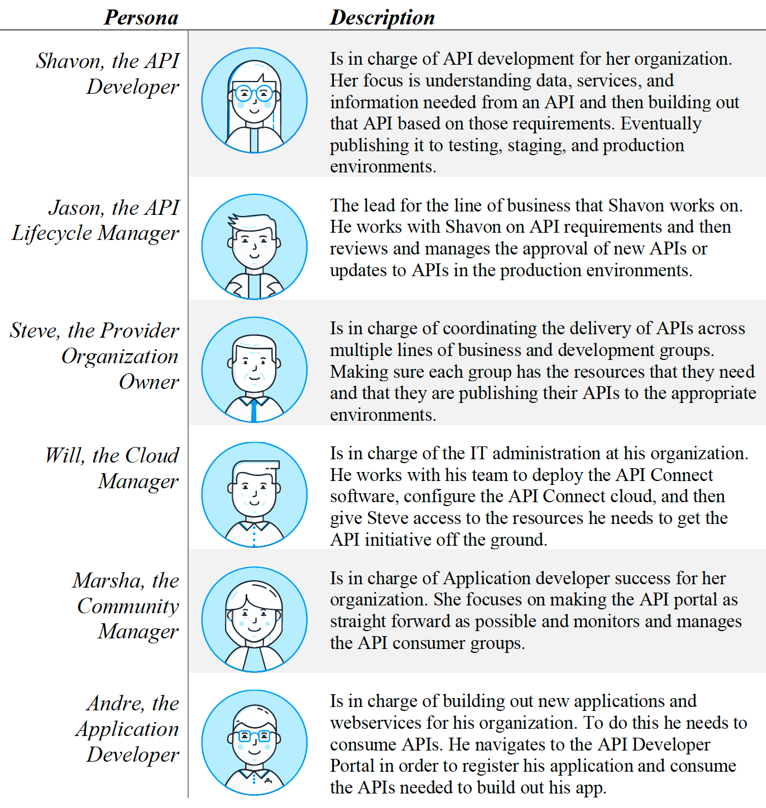

# IBM API Connect

## Introduction
IBM API Connect is an integrated API management offering, with capabilities and tooling for all phases of the API lifecycle. Key steps of the API lifecycle include create, secure, manage, socialize, and analyze.

These lab exercises will walk you through designing, publishing, and securing APIs.

IBM API Connect has several out of the box personas. Some of these personas will be used in the context of these labs.  The [IBM API Connect V10.x Deployment WhitePaper](https://community.ibm.com/HigherLogic/System/DownloadDocumentFile.ashx?DocumentFileKey=21e9c4e0-f733-c7b1-3267-b1a604ebb0e1&forceDialog=0) has more detail.

**Personas in IBM API Connect:**

## Lab Abstracts

# Manage & Secure APIs:

| Subject | Description |  
|---------|-------------|
| [Create and Secure an API](Create-and-Secure/ReadMe.md)       | **Create and Secure an API to Proxy an Existing REST Web Service:**  In this lab, you will get a chance to use the IBM API Connect Developer Toolkit and its intuitive interface to create a new API using the OpenAPI definition (YAML) of the existing Customer Database RESTful web service.  **Prequisite:** None.  **Primary persona**:  Shavon (API Developer)
|---------|-------------|
| [Developer Portal](Developer-Portal/ReadMe.md)       | **The Developer Portal Experience:**  In this lab, we will take the API created in the "Create and Secure an API to Proxy an Existing REST Web Service" lab and publish it to a Developer Portal where it will be ready for consumption by application developers.  **Prequisite:** "Create and Secure an API" lab.  **Primary persona**:  Andre (Application Developer)
|---------|-------------|
| [OAuth Security and Version your API](OAuth-Versioning/ReadMe.md)       | **Add OAuth Security to your API and use Lifecycle Controls to Version Your API:**  In this lab, we will secure the Customer Database API that was created in the "Create and Secure an API to Proxy an Existing REST Web Service" lab to protect the resources exposed by IBM API Connect. Consumers of our API will be required to obtain and provide a valid OAuth token before they can invoke the Customer Database API.  In order for the changes to take effect, we must publish the APIs to the developer portal and make them available for the API Consumers.  **Prequisite:** "Developer Portal Experience" lab.  **Primary personas**:  Shavon (API Developer) and Jason (API Lifecycle Manager)

# API Connect Innovations:

| Subject | Description |  
|---------|-------------|
| [GraphQL Proxy API](GraphQL/ReadMe.md)       | **Creating a GraphQL Proxy API:**  In this lab, we will explore how to define GraphQL APIs that proxy to a backend GraphQL server.  **Prequisite:** None.  **Primary personas**:  Shavon (API Developer) and Andre (Application Developer)
|---------|-------------|
| [Event Endpoint Experience](Event-EndPoint/ReadMe.md)       | **Integration with AsyncAPI's Event Endpoint Experience:**  Show to create an Async API in IBM API Connect Manager, Produce events to IBM Event Streams using IBM App Connect Toolkit Flow, and finally run varies Consumers to read the events
